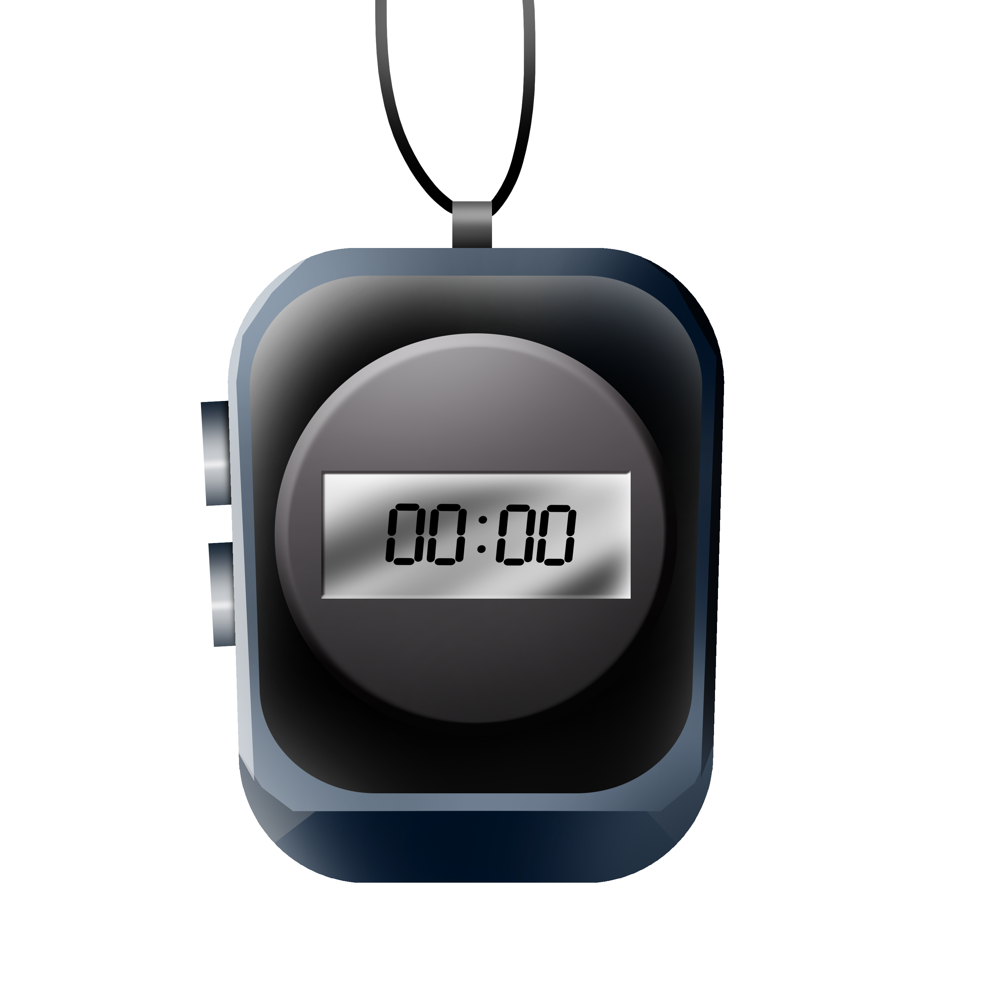

# ⏱️ Projeto Cronômetro

Um cronômetro digital moderno e responsivo desenvolvido com tecnologias web fundamentais. Este projeto oferece uma interface intuitiva para medição de tempo, perfeito para uso em atividades físicas, estudos ou qualquer situação que necessite de controle preciso do tempo.

## 📱 Preview do Projeto



## 🚀 Tecnologias Utilizadas

- **HTML5**: Estruturação semântica do conteúdo
- **CSS3**: Estilização moderna com:
  - Flexbox para layout responsivo
  - Media Queries para adaptação mobile
  - Variáveis CSS para consistência visual
  - Fonte personalizada (Orbitron) para visual digital
  - Background personalizado
- **JavaScript**: Lógica do cronômetro com:
  - Manipulação do DOM
  - Funções de tempo
  - Eventos de interação

## ⚙️ Funcionalidades

- Iniciar contagem do tempo
- Pausar contagem
- Reiniciar cronômetro
- Design responsivo (adaptável a diferentes tamanhos de tela)
- Interface intuitiva e moderna
- Visualização clara dos dígitos

## 💻 Como Usar

1. Clone este repositório:

```bash
git clone [URL-do-seu-repositório]
```

2. Abra o arquivo `index.html` em seu navegador preferido

3. Utilize os botões para controlar o cronômetro:
   - Start: Inicia a contagem
   - Stop: Pausa a contagem
   - Reset: Reinicia o cronômetro para zero

## 📱 Responsividade

O projeto é totalmente responsivo e se adapta a diferentes tamanhos de tela:

- Desktop: Visualização completa com tamanhos otimizados
- Mobile: Interface adaptada para melhor experiência em dispositivos móveis

## 🎨 Personalização

O projeto utiliza uma combinação de cores modernas e fontes específicas para criar uma experiência visual agradável:

- Fonte Orbitron para o visual digital
- Background personalizado
- Cores contrastantes para melhor legibilidade

## 🤝 Contribuição

Contribuições são sempre bem-vindas! Sinta-se à vontade para:

1. Fazer um fork do projeto
2. Criar uma branch para sua feature (`git checkout -b feature/AmazingFeature`)
3. Commit suas mudanças (`git commit -m 'Add some AmazingFeature'`)
4. Push para a branch (`git push origin feature/AmazingFeature`)
5. Abra um Pull Request

## 📝 Licença

Este projeto está sob a licença MIT. Veja o arquivo `LICENSE` para mais detalhes.

---

⌨️ Desenvolvido com ❤️ por [Seu Nome]
